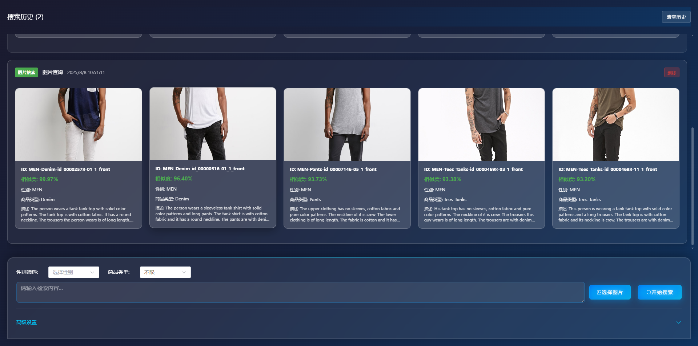

# 多模态服饰检索系统 (Multimodal Fashion Retrieval)

一个基于深度学习的多模态服饰检索系统，支持文本、图片和混合检索模式，提供直观的Web界面进行时尚商品搜索。

## 界面展示



## 🌟 项目特性

### 🔍 多模态检索
- **文本检索**：通过自然语言描述搜索时尚商品
- **图片检索**：上传商品图片进行相似商品搜索
- **混合检索**：结合文本和图片进行更精确的检索
- **权重调节**：可调节文本和图片的权重比例

### 🎨 现代化界面
- **响应式设计**：适配各种屏幕尺寸
- **聊天式历史**：查询历史像聊天界面一样保留
- **图片预览**：支持全屏图片预览功能
- **半透明效果**：毛玻璃背景，现代UI设计

### 📊 智能筛选
- **性别筛选**：男装/女装/不限
- **商品类型**：Denim、Shorts、Pants等
- **结果数量**：可调节返回结果数量
- **相似度显示**：显示每个结果的相似度百分比

## 🛠️ 技术栈

### 后端
- **Python 3.12.3**
- **FastAPI** - 高性能Web框架
- **BLIP** - 多模态预训练模型
- **Milvus** - 向量数据库(本demo使用云数据库：https://cloud.zilliz.com/)
- **Pillow** - 图像处理
- **NumPy** - 数值计算

### 前端
- **node版本** - v20.19.2
- **Vue 3** - 渐进式JavaScript框架
- **Element Plus** - Vue 3组件库
- **Axios** - HTTP客户端
- **Vite** - 构建工具

### 数据处理
- **向量数据库** - 存储商品特征向量
- **图像嵌入** - 提取商品图像特征
- **文本嵌入** - 处理商品描述文本

## 📁 项目结构

```
multimodel_fasion_retrieval/
├── api/                    # 后端API服务
│   ├── main.py            # FastAPI应用入口
│   ├── models/            # 数据模型
│   ├── services/          # 业务逻辑
│   └── utils/             # 工具函数
├── front/                 # 前端Vue应用
│   ├── src/
│   │   ├── components/    # Vue组件
│   │   ├── assets/        # 静态资源
│   │   └── App.vue        # 主应用组件
│   └── package.json       # 前端依赖
├── blip_finetune/         # BLIP模型微调
├── vector_db/             # 向量数据库
├── data_embedding/        # 数据嵌入处理
└── requirements.txt       # Python依赖
```

## 🚀 快速开始

### 环境要求
- Python 3.12.3
- Node.js v20.19.2
- RTX 4090（显存：24G）

### 1. 克隆项目
```bash
git clone https://gitee.com/xiao_rumin/multimodel_fasion_retrieval.git
cd multimodel_fasion_retrieval
```

### 2. 安装后端依赖
```bash
pip install -r requirements.txt
```

### 3. 安装前端依赖
```bash
cd front
npm install
```

### 4. 修改项目根路径
```bash
# /api/main.py，data_embedding/model_vectorization.py 下面的路径改为自己的项目根目录
sys.path.append('/root/autodl-tmp/multimodel_fasion_retrieval')
```
### 5. 下载BLIP模型
```bash
# 下载魔塔的模型下载工具
pip install modelscope
# ./dir可改为你自己的路径
modelscope download --model cubeai/blip-image-captioning-base --local_dir ./dir
```
### 6. 下载数据集：使用以下python代码进行下载
运行完之后代码会在控制台打印下载路径
```python
import kagglehub

# Download latest version
path = kagglehub.dataset_download("silverstone1903/deep-fashion-multimodal")

print("Path to dataset files:", path)
```
### 7. /api/main.py：修改配置和文件路径
```bash
# 云数据库地址（可自行注册然后创建：https://cloud.zilliz.com/）
MILVUS_URI = "https://in03-338d6950a393b2c.serverless.gcp-us-west1.cloud.zilliz.com"
# 云数据库token
MILVUS_TOKEN = "xxxx"
# BLIP预训练模型路径
MODEL_PATH = "/root/autodl-fs/training_results_20250705_165112/model_weights/best_model.pth"
# 微调模型路径
PROCESSOR_PATH = "/root/autodl-fs/blip-image-captioning-base/"
# 向量数据库
COLLECTION_NAME = "fasion_multimodel_embedding"
# 上传目录
UPLOAD_DIR = "uploads"
# 图片目录
IMAGES_DIR = "../../dataset/DeepFashion-MultiModal/selected_images"
```

### 8. 启动后端服务
```bash
cd api
uvicorn main:app --host 0.0.0.0 --port 8000 --reload
```

### 9. 启动前端服务
```bash
cd front
npm install # node版本：v20.19.2
npm run dev
```

### 10. 访问应用
打开浏览器访问 `http://localhost:5173`

## 📖 使用说明

### 文本检索
1. 在搜索框中输入商品描述（如："medium-sleeve shirt with pure color patterns."）
2. 选择性别和商品类型筛选条件
3. 调节文本权重滑块
4. 点击"搜索"按钮

### 图片检索
1. 点击"选择图片"按钮上传商品图片
2. 图片会显示在右上角缩略图
3. 点击缩略图可全屏预览
4. 设置筛选条件后点击"搜索"

### 混合检索
1. 同时输入文本描述和上传图片
2. 调节文本/图片权重滑块
3. 系统会自动判断检索模式
4. 点击"搜索"进行混合检索

### 历史记录
- 每次查询结果都会保留在历史记录中
- 最新的查询显示在底部
- 可以删除单个查询记录
- 支持清空所有历史记录

## 🔧 配置说明

### 后端配置
在 `api/main.py` 中配置：
- 向量数据库路径
- 模型文件路径
- API端口设置

### 前端配置
在 `front/src/App.vue` 中配置：
- API基础URL
- 默认筛选条件
- 界面主题设置

## 🎯 核心功能

### 多模态检索算法
- 使用BLIP模型进行图像-文本联合理解
- 支持文本到图像和图像到文本的检索
- 混合检索通过加权融合两种模态的特征

### 向量数据库
- 使用Milvus进行高效的向量检索
- 支持多种索引类型（IVF、HNSW等）
- 实时更新和增量索引

### 智能权重调节
- 文本权重：0.0-1.0
- 图片权重：自动计算为1-文本权重
- 实时预览权重比例

## 📈 性能优化

### 检索性能
- 向量索引优化
- 批量处理
- 缓存机制

### 前端优化
- 虚拟滚动
- 图片懒加载
- 组件按需加载

## 📞 联系方式

- 项目维护者：子夜求知（全网同名）
- 邮箱：midnight184@163.com
- 项目链接：https://github.com/XiaorRuyang/multimodel_fasion_retrieval
- b站技术频道（子夜求知-tech）：https://space.bilibili.com/1590032202?spm_id_from=333.337.0.0
- b站个人频道（子夜求知）：https://space.bilibili.com/473692166?spm_id_from=333.1007.0.0

## 🙏 致谢

- [BLIP](https://github.com/salesforce/BLIP) - 多模态预训练模型
- [Milvus](https://zilliz.com) - 向量检索库
- [FastAPI](https://fastapi.tiangolo.com/) - 现代Web框架
- [Vue.js](https://vuejs.org/) - 渐进式JavaScript框架
- [Element Plus](https://element-plus.org/) - Vue 3组件库

---

⭐ 如果这个项目对你有帮助，请给它一个星标！ 


[各个文档链接](https://byhr9k7i1h.feishu.cn/docx/R14idDjlxoJqZAxQ4JycHANpnxh)

[bilibili](https://www.bilibili.com/list/watchlater?oid=114997732574629&bvid=BV1Hjt4zeEks&spm_id_from=333.1007.top_right_bar_window_view_later.content.click&p=5)